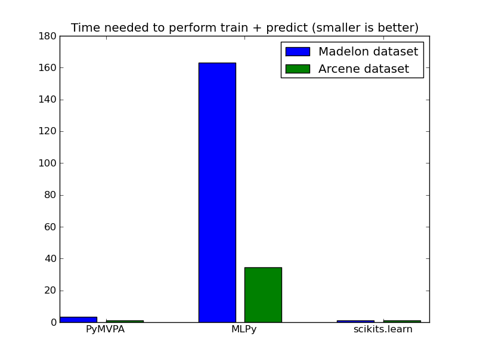

==========
Benchmarks
==========

We compare computation time for a few algorithms implemented in the
major machine learning toolkits accessible in Python.

**Last Update: June-2011**

Time in seconds on the Madelon dataset for various machine learning libraries
exposed in Python: `MLPy <http://mlpy.fbk.eu/>`_, `PyBrain
<http://pybrain.org/>`_, `PyMVPA <http://pymvpa.org>`_, `MDP
<http://mdp-toolkit.sourceforge.net/>`_, `Shogun <http://shogun-toolbox.org>`_
and `MiLK <http://luispedro.org/software/milk>`_. Code for running the
benchmarks can be retrieved from http://github.com/scikit-learn.

We also plot the score on a validation dataset for all algorithms. For
classification algorithms, it's the fraction of correctly classified samples,
for regression algorithms it's the mean squared error and for k-means it's the
inertia criterion.

Used software
-------------

We used the latest released version as of June 2011:

  - scikits.learn 0.8
  - MDP 3.1
  - MLPy 2.2.2
  - PyMVPA 0.6.0~rc3
  - Shogun 0.10.0

I ran it on an Intel(R) Core(TM)2 CPU @ 1.86GHz.

Used datasets
-------------

We use the Madelong and Arcene data set. The `Madelon data set
<http://archive.ics.uci.edu/ml/datasets/Madelon>`_, 4400 instances and 500
attributes, is an artificial dataset, which was part of the NIPS 2003
feature selection challenge. This is a two-class classification problem with
continuous input variables. The difficulty is that the problem is multivariate
and highly non-linear.

The `arcene data set <http://archive.ics.uci.edu/ml/datasets/Arcene>`_ task is
to distinguish cancer versus normal patterns from mass-spectrometric data.
This is a two-class classification problem with continuous input variables.
This dataset is one of 5 datasets of the NIPS 2003 feature selection
challenge. All details about the preparation of the data are found in our
technical report: Design of experiments for the NIPS 2003 variable selection
benchmark, Isabelle Guyon, July 2003.

Support Vector Machines
-----------------------

We used several Support Vector Machine (RBF kernel) implementations. Numbers
represent the time in seconds (lower is better) it took to train the dataset
and perform prediction on a test dataset. In the plot, results are normalized
to have the fastest method at 1.0.

.. table:: Results in scikits.learn ml-benchmarks

     ============      =======       ======     ====     =======     ========    =============      ========
          Dataset       PyMVPA       Shogun      MDP     Pybrain         MLPy    scikits.learn          Milk
     ============      =======       ======     ====     =======     ========    =============      ========
          Madelon        12.89         6.03       --          --        10.88             6.23          4.90
          Arcene          1.37         0.42       --          --         1.75             0.41      **0.34**
     ============      =======       ======     ====     =======     ========    =============      ========

.. figure:: bench_svm.png
   :scale: 60%
   :align: center

The score by these calssfifiers in in a test dataset is.

.. warning::

     This is just meant as a sanity check, should not be taken at face
     value since parameters are not cross-validated, etc.

.. table:: Score in scikits.learn ml-benchmarks

     ============    =======    ======    ====    =======   ===========   =============    ========
          Dataset     PyMVPA    Shogun    MDP     Pybrain          MLPy   scikits.learn        milk
     ============    =======    ======    ====    =======   ===========   =============    ========
          Madelon        0.5       0.0      --         --          0.65            0.65         0.0
          Arcene        0.56      0.56      --         --          0.56            0.56        0.56
     ============    =======    ======    ====    =======   ===========   =============    ========

.. Logistic Regression
.. -------------------
..
.. TODO

K-means
-------

We run the k-means algorithm on both Madelon and Arcene dataset. To make sure
the methods are converging, we show in the second table the inertia of all
methods, which are mostly equivalent.

Note: The shogun is failling ..

.. table:: Timing for k-Means algorithm

     ============  =====   =======   ========    =============    ========
          Dataset    MDP   Pybrain       MLPy    scikits.learn        milk
     ============  =====   =======   ========    =============    ========
          Madelon  35.75        NC       0.79             1.34    **0.67**
           Arcene   2.07     20.50       0.33             0.51    **0.23**
     ============  =====   =======   ========    =============    ========

NC = Not Converging after one hour iteration.

.. figure:: bench_kmeans.png
   :scale: 60%
   :align: center

The following table shows the inertia, criterion that the k-means algorithm minimizes.

.. table:: Inertia

     ============   ==========     =======     ===========    =============     ==============
          Dataset          MDP     Pybrain            MLPy    scikits.learn               Milk
     ============   ==========     =======     ===========    =============     ==============
          Madelon     7.4x10^8          --        7.3x10^8         7.4x10^8           7.3x10^8
           Arcene     1.4x10^9          oo        1.4x10^9         1.4x10^9           1.4x10^9
     ============   ==========     =======     ===========    =============     ==============

Elastic Net
-----------

We solve the elastic net using a coordinate descent algorithm on both Madelon and Arcene dataset.

.. table:: Results in scikits.learn ml-benchmarks

     ============     =======    ========    =============
          Dataset     PyMVPA         MLPy    scikits.learn
     ============     =======    ========    =============
          Madelon        1.66        73.7             0.47
           Arcene        2.46       65.48             1.90
     ============     =======    ========    =============

.. table:: Mean squared error

     ============     =======    ========    =============
          Dataset     PyMVPA         MLPy    scikits.learn
     ============     =======    ========    =============
          Madelon       699.1      3759.8            577.3
           Arcene       84.92      151.28            65.39
     ============     =======    ========    =============

Lasso (LARS algorithm)
----------------------

We solve the Lasso model by Least Angle Regression (LARS) algorithm. MLPy and
scikits.learn use a pure Python implementation, while PyMVPA uses bindings to
R code.

We also show the Mean Squared error as a sanity check for the model. Note
that some NaN arise, probably due to collinearity in the data.

.. table:: Timing

     ============    =======  ===========    =============
          Dataset     PyMVPA         MLPy    scikits.learn
     ============    =======  ===========    =============
          Madelon      36.32        105.3             1.17
           Arcene       9.99         3.82             2.95
     ============    =======  ===========    =============

.. figure:: bench_lars.png
   :scale: 60%
   :align: center

.. table:: Mean Squared Error on a test dataset

     ============  =======  =============    =============
          Dataset   PyMVPA           MLPy    scikits.learn
     ============  =======  =============    =============
          Madelon      NaN         682.32           680.91
           Arcene      NaN            NaN            65.39
     ============  =======  =============    =============

Principal Component Analysis
----------------------------

We run principal component analysis on the madelon datasets. In the libraries
that support it (scikit-learn, MDP, PyMVPA), we number of components in the
projection to 9. For the arcene dataset, most libraries could not handle the
memory requirements.

.. table:: Timing PCA

     ============     =======   ====   =======   =============   ========
          Dataset      PyMVPA    MDP   Pybrain   scikits.learn       milk
     ============     =======   ====   =======   =============   ========
          Madelon        0.48   0.47      8.93            0.18       3.07
     ============     =======   ====   =======   =============   ========

.. figure:: bench_pca.png
   :scale: 60%
   :align: center

.. table:: explained variance

     ============     ========   ========   ========   =============   =========
          Dataset       PyMVPA        MDP    Pybrain   scikits.learn        milk
     ============     ========   ========   ========   =============   =========
          Madelon     136705.5   136705.5   228941.0        135788.2   455715.83
     ============     ========   ========   ========   =============   =========

Misc
----

Author : Fabian Pedregosa
License : Simplified BSD
